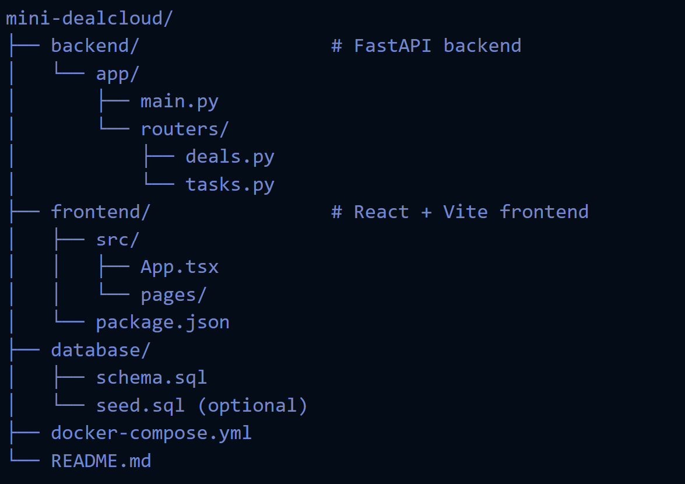

# Mini-DealCloud

A starter project for a deal pipeline tracker (like a lightweight DealCloud clone) built with:
*   **Frontend:** React + TypeScript + Vite
*   **Backend:** FastAPI (Python)
*   **Database:** PostgreSQL
*   **DevOps:** Docker + Docker Compose

## 🚀 Quick Start
1.  **Clone**
    ```sh
    cd mini-dealcloud
    ```
2.  **Start Services with Docker (recommended)**
    ```sh
    docker-compose up --build
    ```
This will start:
*   PostgreSQL (port 5432)
*   FastAPI backend (port 8000)
*   React frontend (port 5173)

Once the containers are up, you can access:
*   **Backend API** → http://localhost:8000
*   **Frontend App** → http://localhost:5173

## 🖥️ Running Without Docker
You can also run backend and frontend locally without containers.

### Backend (FastAPI)
```sh
cd backend
pip install -r requirements.txt
uvicorn app.main:app --reload
```

Backend API: http://localhost:8000
Health check: curl http://localhost:8000/health

### Frontend (React + Vite)

```sh
cd frontend
pnpm install   # or npm install / yarn install
pnpm dev
```

Frontend App: http://localhost:5173

### 🗄️ Database Setup

Load schema:

```sh
docker exec -i mini-dealcloud-db-1 psql -U user -d dealcloud < database/schema.sql
```

(Replace container name if different.)

Optional: load seed data

```sh
docker exec -i mini-dealcloud-db-1 psql -U user -d dealcloud < database/seed.sql
```

### 📂 Project Structure




### 🔑 Features (MVP)

* Deal tracking (basic pipeline view)
* Task tracking tied to deals
* REST API endpoints (/deals, /tasks)
* Dashboard & deal detail pages (frontend stubs)